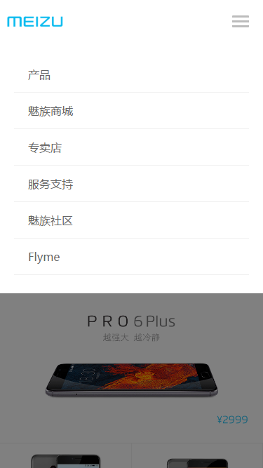
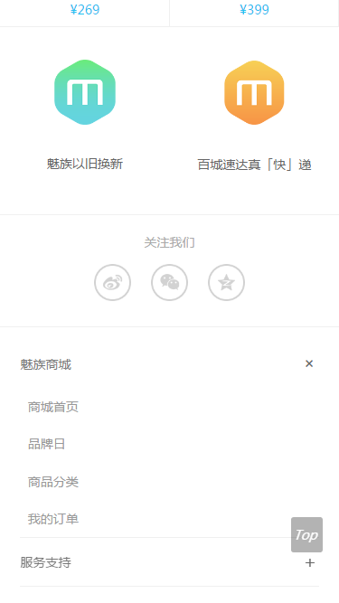
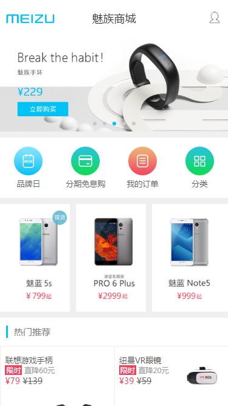
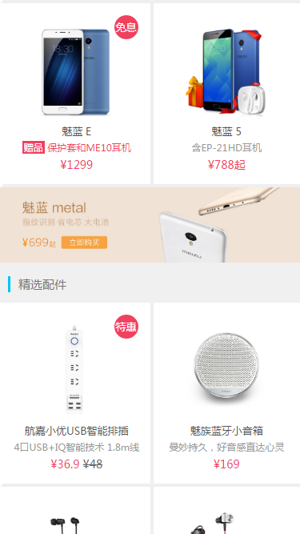
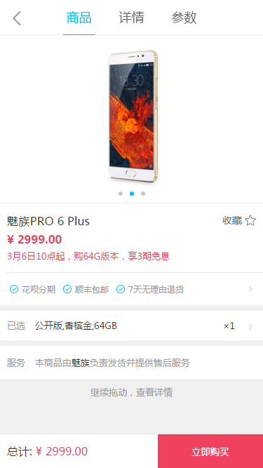
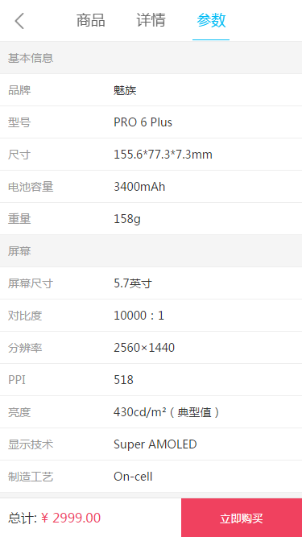
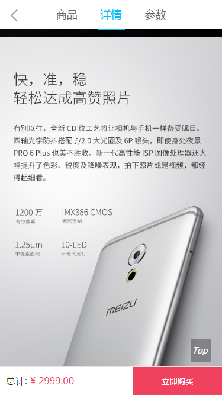

# Vue-Meizu-Mall
基于vue实现，仿MEIZU商城单页面应用，目前有首页、商城页和商品详情页。

### 运行
```
node环境下执行: 
    node app.js
    
浏览器输入:
    localhost:3000
```
## 预览

#### 首页




#### 商城页



#### 商品页




### 技术栈
<pre>
 vue1.x
 requireJs
 require-css
</pre>
